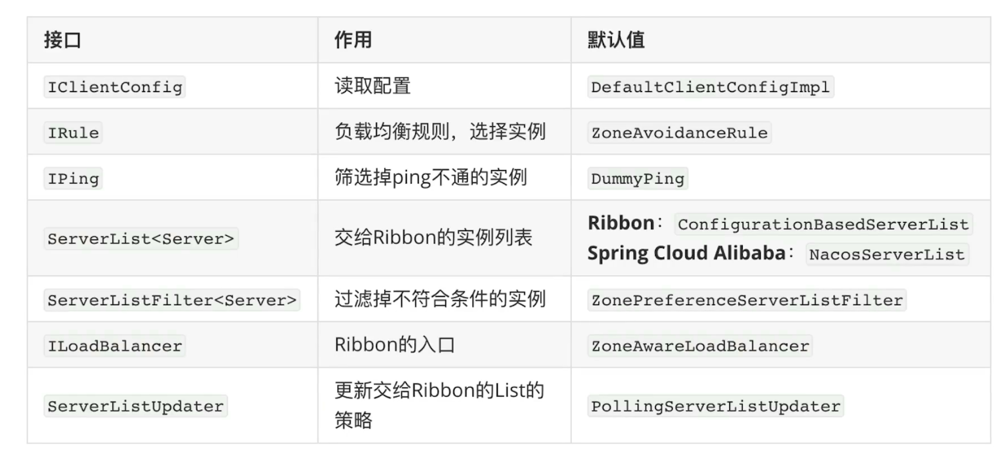
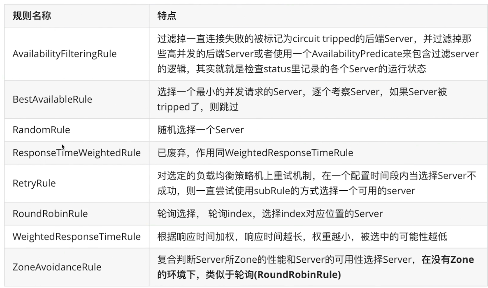
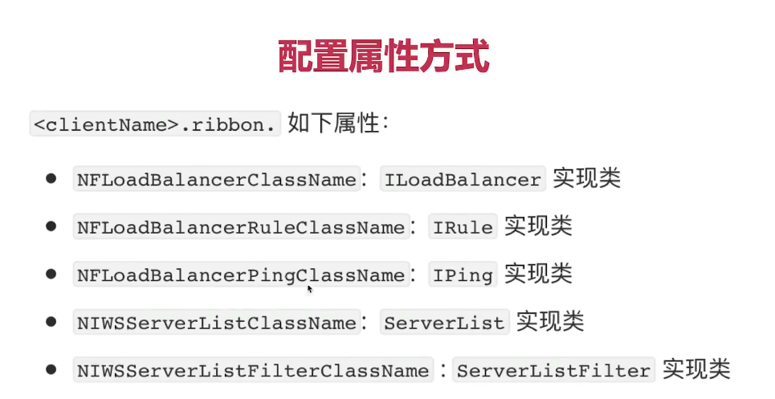

#版本理解
###1.语义化的版本理解 举例
```
<version>2.1.5.RELEASE</version>
a.2表示主版本
b.1表示次版本，一些功能的增加，但是架构没有太大的变化，是兼容的
c.5增量版本，BUG修复

SHAPSHOT: 开发版
M: 里程碑
RELEASE: 正式版
```
####2.spring cloud （使用伦敦地铁站来进行命名（Angel,Brixton））
```
SR1（Service Relase）:bug修复
Angel SR1
Angel RELEASE 第一个正式版
Angel RELEASE -> 第一个正式版 -> SR1 ->SR2
```
###3.spring cloud spring cloud alibaba spring boot 版本兼容 
```
https://github.com/alibaba/spring-cloud-alibaba
```
##ribbon -------------- 
###4.ribbon代码简单解析

###5.ribbon内置的负载均衡规则

###6. ribbon使用配置文件配置属性配置规则

例子：
```
user-center:
  ribbon:
    NFLoadBalancerRuleClassName: com.netflix.loadbalancer.RandomRule
```
###7.默认情况下，ribbon是懒加载的（也就是第一次执行到，才进行实例化）
```
1.如何变成饥饿加载
#开启ribbon的饥饿加载模式（多个用逗号隔开）
ribbon:
  eager-load:
    clients: user-center
    enabled: true
```
